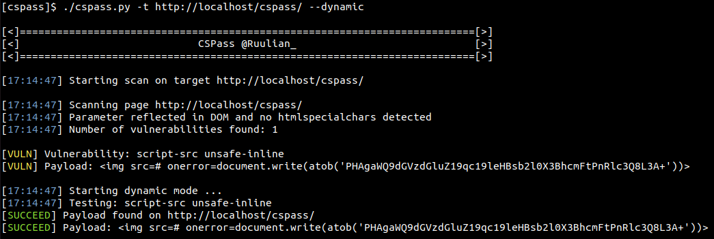

# CSPass

This tool allows to automatically test for Content Security Policy bypass payloads.

With dynamic mode, CSPass uses selenium to test payload directly on the page and returns if payload worked or not.



## Installation

You can install CSPass by downloading the zip folder [here](https://github.com/Ruulian/CSPass/archive/refs/heads/master.zip).

You can also install it by cloning the git repository:
```
git clone https://github.com/Ruulian/CSPass.git
```

## Usage

```
[CSPass]~$ ./cspass.py -h
usage: cspass.py [-h] [--no-colors] [-d] [-a] -t TARGET [-c COOKIES]

CSP Bypass tool

optional arguments:
  -h, --help            show this help message and exit
  --no-colors           Disable color mode
  -d, --dynamic         Use dynamic mode
  -a, --all-pages       Looking for vulnerability in all pages could be found

Required argument:
  -t TARGET, --target TARGET
                        Specify the target url

Authentication:
  -c COOKIES, --cookies COOKIES
                        Specify the cookies (key=value)
```

## Examples

You can try using CSPass on vulnerable websites by running docker, there are 2 runners: `run_bg.sh` and `run_fg.sh`.

This container gets 3 pages with differents vulnerables CSP where you can handhold the tool.

## Contributing

Pull requests are welcome. Feel free to open an issue if you want to add other features.