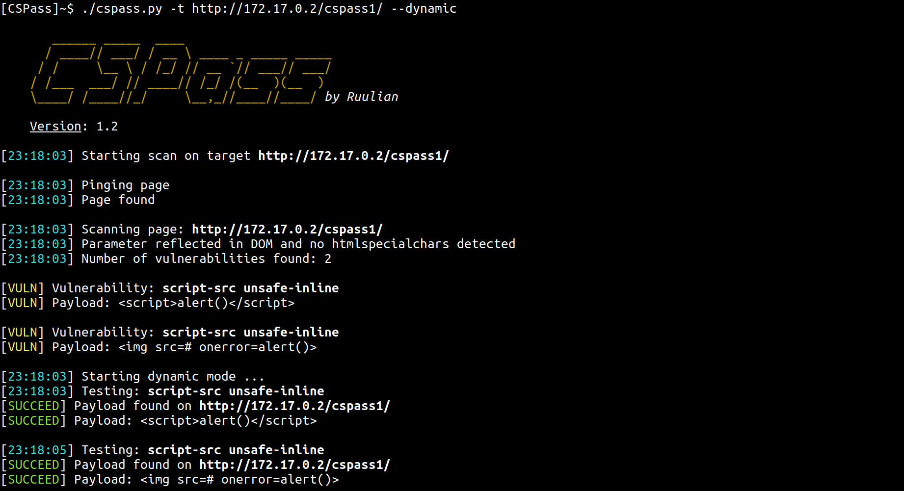

# CSPass

This tool allows to automatically test for Content Security Policy bypass payloads.



## Usage

```
[cspass]$ ./cspass.py -h
usage: cspass.py [-h] [--no-colors] [-d] [-a] -t TARGET

Bypass CSP to perform a XSS

optional arguments:
  -h, --help            show this help message and exit
  --no-colors           Disable color mode
  -d, --dynamic         Use dynamic mode
  -a, --all-pages       Looking for vulnerability in all pages could be found

Required argument:
  -t TARGET, --target TARGET
                        Specify the target url
```

## Contributing

Pull requests are welcome. Feel free to open an issue if you want to add other features.